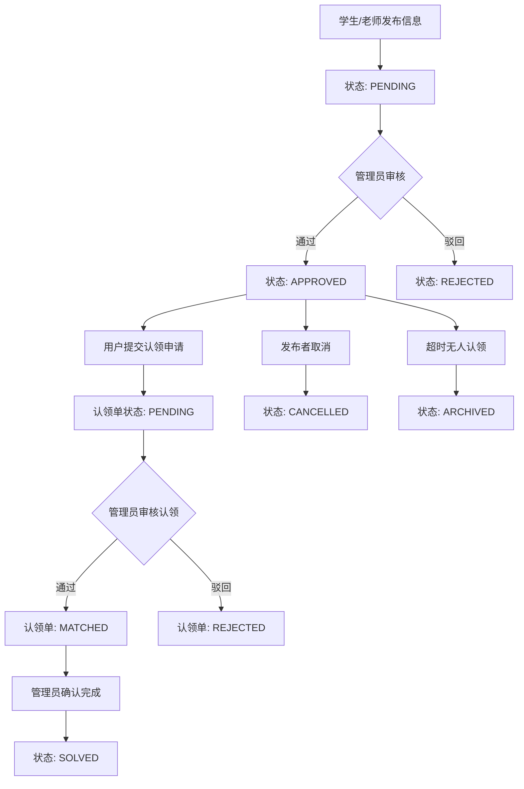

# 校园失物招领软件设计

## 一、概述

### 1.1 产品定义

本校园失物招领系统是面向高校场景设计的一体化数字化管理平台，旨在解决校园里失物与招领信息不对称、人工管理效率低、信息追溯难等问题。系统通过区分学生/老师、失物招领管理员、系统管理员三类用户角色，提供信息发布、审核、查询、认领、账号权限管理、数据统计与维护等核心功能，实现失物招领全流程的规范化、数字化、高效化管理，降低校园物品丢失后的找回成本，提升校园管理服务水平。

### 1.2 产品目标

#### 1.2.1 核心目标

- 为师生提供便捷的失物招领信息发布、查询、认领渠道，提升失物找回率，减少师生财产损失。
- 为失物招领管理员提供标准化的信息审核、状态管理工具，降低人工审核与台账管理的工作量。
- 为系统管理员提供全局化的权限管控、数据治理能力，保障系统稳定运行和信息合规性。

#### 1.2.2 具体目标

- **信息流转效率**：失物/招领信息从发布到审核完成效率提高。
- **业务覆盖度**：支持校园内大多数类型的失物（如饭卡、证件、电子产品、等）招领流程管理。
- **数据可追溯**：所有未清理的发布、审核、认领操作均留存日志，支持的历史数据查询与导出。
- **系统易用性**：师生端和管理员端核心功能操作步骤简化。

## 二、产品描述

### 2.1 名词解释

| 名词 | 定义说明 |
|------|----------|
| 学生/老师 | 系统基础用户，拥有失物/招领信息发布、查询、认领申请、个人发布记录管理等权限。 |
| 失物招领管理员 | 系统业务管理员，负责失物/招领信息审核、物品状态维护、信息更新与通知等核心业务管理。 |
| 系统管理员 | 系统超级管理员，负责全局权限、账号、数据、公告等最高级别的系统管控。 |
| 待审核（PENDING） | 师生发布的失物/招领信息提交后，尚未经失物招领管理员审核的状态。 |
| 已通过（APPROVED） | 失物/招领信息经管理员审核符合规范，正式发布在系统中的状态。 |
| 已驳回（REJECTED） | 管理员审核后认为信息不真实、不完整或违规，拒绝发布的状态（需填写驳回理由）。 |
| 已取消（CANCELLED） | 发布者在信息"已通过"后主动终止发布的状态。 |
| 已完成/已认领（SOLVED） | 管理员完成认领处理后的最终状态。 |
| 已归档（ARCHIVED） | 超过认领时效（初始30天）无人认领的物品，管理员标记的封存状态（需记录处理方式）。 |
| 认领申请状态（PENDING/MATCHED/REJECTED） | 认领申请单独维护审核状态，已提出申请不直接改变发布信息主状态。 |
| 认领申请 | 失主发现需求的失物/招领信息后，向系统提交的物品归还/取回申请（需补充证明信息）。 |

### 2.2 产品功能结构图

### 2.3 后端实现架构

- 架构分层：采用 `API -> Service -> Repo -> Model` 分层，接口层处理鉴权与参数校验，服务层承接流程编排，仓储层统一数据访问，模型层对应数据库实体。
- 状态机设计：发布信息主状态使用 `PENDING/APPROVED/SOLVED/CANCELLED/REJECTED/ARCHIVED`，认领申请使用 `PENDING/MATCHED/REJECTED`，两条状态线分离实现。
- 配置驱动：物品类型、反馈类型、认领时效、每日发布上限由系统配置表驱动，运行时可更新并即时生效。
- 数据结构与并发控制：智能助手会话在内存中以 `map[session_id]*ChatSession` 管理，结合 `sync.RWMutex` 进行并发读写保护，并与数据库会话/消息表同步。
- 检索能力：发布后异步生成向量并写入 Milvus，向量仓储提供 `Insert/Delete/Update/Search`，用于语义检索能力扩展。

### 2.4 智能助手（Agent）模块

- 模块定位：为学生/老师提供对话式失物招领操作入口，覆盖查询、发布、认领、反馈、会话历史查看等能力。
- 接口能力：提供会话创建、会话列表、历史消息查询、流式对话输出（SSE）接口。
- 设计模式：采用 ReAct Agent + Tool Calling 模式，工具集合覆盖 `search_posts`、`get_post_detail`、`publish_post`、`apply_claim`、`submit_feedback` 等业务动作。
- 数据持久化：会话与消息双表持久化，流式回复结束后落库 assistant 消息；服务层缓存用于提升会话读取效率。
- 运行控制：支持 Agent 功能总开关；关闭时接口直接返回不可用状态码。

## 三、详细功能需求描述

### （一）学生/老师界面

#### 1.1 页面流程图

#### 1.2 登录页

**页面名称**：登录页

**用户场景**：用户需要访问失物招领系统，通过登录页面验证身份并进入系统。

**功能描述**：
- 用户登录：学号/工号及统一密码（初始为身份证后六位）
- 忘记密码：提供链接帮助用户找回密码
- 修改密码：首次登陆的用户密码需要强制修改密码

**优先级**：高

**前置条件**：用户访问系统首页或直接导航到登录页面。

**需求描述**：

**组件与布局逻辑**

页面顶部：
- 包含失物招领管理员、系统管理员的登录页面跳转链接，位于页面右上角

登录区域：
- 登录区域位于页面中央，包含以下组件：
  - 账号输入框：用户输入学号/工号。
  - 密码输入框：用户输入密码。
  - 显示/隐藏密码图标：密码输入框右侧
  - 登录按钮：用户点击后提交登录信息进行验证。

密码修改页面：
- 包含学号输入框、密码输入框、新密码输入框（密码由6-16位字母（区分大小写）、数字或符号组成）、确认新密码输入框、确认按钮。

辅助链接：
- 修改密码链接：位于登录区域左下方，用户点击后可以跳转到找回密码页面。
- 忘记密码链接：位于登录区域右下方，用户点击后可以跳转到找回密码页面。

忘记密码弹窗：
- 包含学号、身份证号码和"确认"按钮。
- 提示用户通过账号与身份证号码校验后重置密码（重置为身份证后六位）。

首次登录提示弹窗：
- 显示"首次登录请修改密码"及"立即前往"跳转链接。

**填充逻辑**

登录区域：
- 学号输入框：默认为空，等待用户输入。
- 密码输入框：默认为空，等待用户输入。右侧有眼睛图标，默认为不可见状态，不可见时根据密码长度填充相应"x"。

忘记密码弹窗：
- 输入框为空。

**交互逻辑**

登录交互：
- 点击输入框，出现光标引导用户输入对应信息。
- 点击显示/隐藏图标：显示/隐藏密码
- 点击登录按钮，提交登录信息进行验证，如果信息正确则跳转到主页，否则显示错误信息。

忘记密码交互：
- 用户点击"忘记密码"，弹出对应弹窗。
- 点击输入框，出现光标引导用户输入对应信息。
- 输入相关信息，点击"确认"，系统通过账号与身份证号码校验后重置密码，用户回到登录页面。

首次登录提示交互：
- 若为首次登录，弹出提示弹窗，点击"立即前往"跳转到修改密码页面。

**后置条件**：
- 密码重置成功后返回登录页面。
- 修改密码完成后跳转至系统主界面。

---

#### 1.3 主界面

##### 1.3.1 "失物招领相关通知与公告"弹窗

**页面名称**：通知公告弹窗

**用户场景**：用户进入失物招领系统后，在使用系统的功能前需要了解相关通知与公告

**功能描述**：
- 用户浏览通知与公告
- 用户点击确认后弹窗隐藏

**优先级**：高

**前置条件**：用户完成登录或首次登录修改密码成功后跳转到主界面

**需求描述**：

**组件与布局逻辑**
- 通知公告内容从上到下按照时间依次显示从晚到早的通知与公告，如更新公告（版本号与新功能、更新内容）、服务稳定通知等
- 通知公告内容可垂直滚动
- 从上到下依次为通知公告区域、确认图标

**填充逻辑弹窗**
- 图标以简洁、易懂的风格呈现，可根据系统整体设计风格进行配色和样式设计。

**交互逻辑**
- 鼠标在通知公告区滚动可浏览所有内容
- 点击"确认"隐藏弹窗，显示完整的主界面（在确认之前无法与在主界面交互）

**后置条件**：点击确认后弹窗隐藏，显示完整主界面

---

##### 1.3.2 顶部导航栏

**页面名称**：顶部导航栏

**用户场景**：用户在使用失物招领系统的过程中，通过顶部导航栏进行反馈意见、退出登录的操作。

**功能描述**：
- 查询信息功能：点击"查询信息"，用户可进入查询信息页
- 发布信息功能：点击"发布信息"，用户可进入发布信息页
- 管理发布功能：点击"我的发布"，用户可进入我的发布页，管理用户发布的信息
- 意见反馈功能：点击意见箱图标，用户可提交对系统的意见和建议并查看历史信息。
- 退出登录功能：点击退出登录图标，可退出登录。

**优先级**：高

**前置条件**：用户已登录失物招领系统，并且确认系统公告

**需求描述**：

**组件与布局逻辑**
- 导航栏位于页面顶部，图标水平排列。
- 中间从左到右依次为"查询信息"、"发布信息"、"我的发布"
- 右侧从左到右依次为退出登录图标、意见箱图标。

**填充逻辑**
- 图标以简洁、易懂的风格呈现，可根据系统整体设计风格进行配色和样式设计。

**交互逻辑**
- 返回主页交互：点击返回主页图标，页面跳转至系统主页。
- 功能交互：点击顶部中间的"查询信息"、"发布信息"或"我的发布"，页面跳转至相应的页面
- 意见反馈交互：点击意见箱图标，显示意见反馈弹窗，用户可输入内容并提交，或者点击查看历史记录。
- 退出登录交互：点击退出登录图标，显示确认退出的弹窗

**后置条件**：无

---

##### 1.3.3 意见反馈弹窗（增加）

**页面名称**：意见反馈弹窗

**用户场景**：用户在进入意见反馈页，提交意见与反馈，并查看历史意见、投诉与反馈记录

**功能描述**：意见反馈功能：点击意见箱图标，用户可提交对系统的意见和建议并查看历史记录。

**优先级**：高

**前置条件**：用户在点击顶部导航栏意见箱图标，进入显示意见反馈弹窗

**需求描述**：

**组件与布局逻辑**
- 投诉与反馈弹窗：投诉与反馈类型（恶意发布、信息不全、不实消息、恶心血腥、涉黄信息、其它类型）（必选）选项（选择"其它类型"显示类型输入框和"取消"、"确认"），投诉与反馈说明输入框（限500字）(可选）

**填充逻辑**
- 投诉与反馈类型（恶意发布、信息不全、不实消息、恶心血腥、涉黄信息、其它类型）：从上到下排列
- "其它类型"输入框限15字
- 投诉与反馈说明输入框（限500字）(可选）

**交互逻辑**
- 不可与弹窗区域之外交互
- 勾选至少一种投诉与反馈类型
- 勾选"其它类型"：显示类型输入框，用户输入文字
- 投诉与反馈说明输入框：输入文字
- 点击"取消"：隐藏投诉与反馈弹窗
- 满足类型必选，说明为可选：用户可选中"确认"按钮
- 点击"确认"：提交投诉与反馈信息给系统管理员

**后置条件**：提交反馈与投诉：意见与反馈页面的"查看历史记录"列表中新增一条"待审核"记录

---

#### 1.5 查询信息页

**页面名称**：查询信息页

**用户场景**：用户物品需要找回或归还，通过点击系统主页顶部中间位置"查询信息"板块进入该页面，填点击相关筛选按钮，点击"查看"后查看信息列表并进入物品详情页，进行认领与沟通。

**功能描述**：
- 信息筛选功能：用户可按物品类型、校区、时间范围组合筛选，也可直接点击"查看"获取已通过信息列表。
- 查看物品详情功能：用户在信息列表中点击任一条，进入物品详情页（物品信息实时变更）。
- 认领与沟通功能：用户在物品详情页点击"认领申请"，输入物品额外信息或相关证明信息，点击确认上传数据给失物招领管理员。
- 投诉反馈功能：用户点击"投诉与反馈"，勾选类型并填写说明，点击确认上传数据给系统管理员

**优先级**：高

**前置条件**：用户已进入失物招领系统确认通知与公告，且点击主页顶部中间位置"查询信息"板块。

**需求描述**：

**组件与布局逻辑**
- 页面顶部：显示"查询信息"、"发布信息"、"我的发布"、意见箱图标、退出登录图标（同系统顶部导航栏）。
- 筛选框：位于页面上方，显示物品类型、丢失/拾取校区、时间范围
- 每个刷筛选类型的隐藏下拉框：包含该筛选类型的既定选项
  - 物品类型：电子、饭卡、文体、证件、衣包、饰品、其它类型
  - 丢失/拾取校区：朝晖/屏峰/莫干山
  - 时间范围：近24小时/3天/7天/30天
- 物品类型中的"其它类型"为固定选项
- 物品信息列表：按照时间从晚到早的顺序从上到下排列，可垂直滚动查看；每一条显示物品名称、丢失/拾取地点、遗失时间
- 物品详情页：包括物品详情区域和下方的"返回"、"投诉与反馈"、"认领申请"；物品详情区域包括：物品类型、名称、物品状态、描述特征、拾取/丢失校区、具体地点、时间范围、存放地点、认领人数、联系方式（仅对管理员和失主/拾主可见）、有无悬赏、照片
- 认领与沟通弹窗：弹窗标题下方依次有"归还"和"找回"按钮，物品额外特征或相关证明输入框，输入框下方有提交照片的图标，底部是"取消"与"确认"按钮
- 投诉与反馈弹窗：投诉与反馈类型（恶意发布、信息不全、不实消息、恶心血腥、涉黄信息、其它类型）（必选）选项（选择"其它类型"显示类型输入框和"取消"、"确认"），投诉与反馈说明输入框（限500字）(可选）

**填充逻辑**
- 物品信息列表：按照时间从晚到早的顺序从上到下排列，每一条显示物品名称、丢失/拾取地点、遗失时间
- 物品详情页：物品详情区域从上到下依次为：物品类型、名称、物品状态、描述特征、拾取/丢失校区、具体地点、时间范围、存放地点、认领人数、联系方式（仅对管理员和失主/拾主可见）、有无悬赏、照片（最多显示3张，居左排列）
- 认领与沟通弹窗：物品额外特征或相关证明输入框限500字；输入框下方初始无图片显示，仅有上传图标，提交的照片最多提交3张（居左排列）
- 投诉与反馈弹窗："其它类型"输入框限15字，投诉与反馈说明输入框（限500字）(可选）

**交互逻辑**

信息筛选与查看交互：
- 鼠标悬停或点击任一筛选选项：显示下拉栏，鼠标移开该区域则隐藏下拉栏。
- 物品类型：电子、饭卡、文体、证件、衣包、饰品、其它类型
- 丢失/拾取校区：朝晖/屏峰/莫干山
- 时间范围：近24小时/3天/7天/30天
- 点击"查看"：显示物品信息列表；若选择筛选项则按筛选条件过滤。
- 鼠标在列表中滚动：列表垂直滚动显示更多物品的信息。
- 点击列表中任一条进入该物品详情页。

认领与沟通交互：
- 在物品详情页中点击"认领申请"显示认领与沟通弹窗
- 点击"归还"或"找回"按钮，只可选其一
- 在物品额外特征或相关证明输入框中输入文字
- 点击提交照片的图标：从本地相册中选取，上传后在预览区域显示图片。
- 点击"取消"：隐藏认领与沟通弹窗
- 点击"确认"：提交认领申请与信息给失物招领管理员

投诉与反馈交互：
- 在物品详情页中点击"投诉与反馈"显示投诉与反馈弹窗
- 勾选至少一种投诉与反馈类型
- 勾选"其它类型"：显示类型输入框，用户输入文字
- 投诉与反馈说明输入框：输入文字
- 点击"取消"：隐藏投诉与反馈弹窗
- 满足类型必选，说明可选：用户可选中"确认"按钮
- 点击"确认"：提交投诉与反馈信息给系统管理员

**后置条件**：
- 提交认领申请：用户"管理发布消息"页新增一条认领申请记录（申请状态为"待审核"），发布信息主状态保持不变
- 提交反馈与投诉：意见与反馈页面的"查看历史记录"列表中新增一条"待审核"记录

**实现说明**：查询接口仅返回审核通过（APPROVED）的发布记录，分页参数（page、page_size）必填；筛选项全部为可选条件并支持组合查询。

---

#### 1.6 发布信息页

**页面名称**：发布信息页

**用户场景**：用户有物品需要找回或归还，通过点击系统主页顶部中间位置"发布信息"板块进入该页面，填写相关信息，提交发布后等待系统管理员审核、其它用户认领申请并完成认领与沟通。

**功能描述**：
- 信息填写功能：用户需选择发布类型，勾选带筛选信息，并填写物品详细信息，如物品名称、类型、丢失地点、丢失时间、物品特征、联系人及联系电话、是否有悬赏（可选），可上传物品相关照片（如有）。
- 信息提交功能：用户填写完信息后点击确认按钮，信息上传给系统管理员进入待审核状态。

**优先级**：高

**前置条件**：用户已进入失物招领系统确认通知与公告，且点击主页顶部中间位置"发布信息"板块。

**需求描述**：

**组件与布局逻辑**
- 页面顶部：显示"查询信息"、"发布信息"、"我的发布"、意见箱图标、退出登录图标（同系统顶部导航栏）。
- "失物"与"招领"选项：导航栏下方
- 带筛选信息的选项："失物"与"招领"选项下方，包括物品类型、丢失/拾取校区、时间范围
- 每个刷筛选类型的隐藏下拉框：包含该筛选类型的既定选项，"物品类型"可选其它类型
- "其它类型"为固定可选标签
- 信息填写区域：包含物品名称、物品类型、丢失/拾取校区、具体地点输入框、物品特征、存放地点(招领有，失物无)、联系人及联系电话、是否有悬赏（可选），可上传物品相关照片（如有）。
- 下方有"取消""确认"按钮。
- 勾选框（必选）、"《失物招领内容规范》"链接：在"取消""确认"按钮下方；[《失物招领内容规范》](https://zjutjhwl.feishu.cn/docx/XP9vdJHImotlDjxw5IfcRPZTnFg?from=from_copylink)
- 信息发布完成后显示提示文字"已提交信息，等待审核中..."

**填充逻辑**
- 带筛选信息的选项：横向排列；包括物品类型、丢失/拾取校区、时间范围
- 信息填写区域：
  - 物品名称（限15字）、具体地点（30字）、存放地点（30字）(招领有，失物无)、物品特征（100字）、联系人（限10字）及联系电话（仅11位数字）输入框为空。
  - 有无悬赏选项：输入框下方
  - 上传图标：有无悬赏下方，初始无图片显示，仅有上传图标，提交的照片最多提交3张（居左排列）；发布招领信息时，必须上传物品清晰照片，便于失主确认，并提示用户

**交互逻辑**

信息填写、提交交互：
- 勾选"失物"或"招领"（必选），勾选带筛选信息的选项（全部必选）
- 可选择"其它类型"作为固定标签
- 点击各个输入框（必填），出现光标引导用户输入对应信息。
- 勾选有无悬赏（可选）
- 点击物品照片上传区域的上传图标，可从本地选择图片上传，上传后在预览区域显示图片；发布招领信息时，必须上传物品清晰照片，便于失主确认
- 点击"《失物招领内容规范》"：显示相关文件，仅阅读
- 点击勾选框："确认"才能被选中
- 点击"确认"按钮，系统验证信息（如必填项是否填写、联系方式格式是否正确等）。
- 验证通过后生成数据，提交给系统管理员；
- 验证不通过则提示用户填写正确信息。
- 点击"返回主页"：跳转至主界面并保留编辑的信息

**后置条件**：
- 提交发布消息：用户"管理发布消息"页的"失物"（对应认领申请中"找回"）或"招领"（对应"归还"）物品状态列表新增一条"待审核"
- 点击"返回主页"：跳转至主界面并保留编辑的信息

**实现说明**：后端发布流程会校验每日发布上限、物品类型合法性与必填字段；发布类型为"招领"时必须上传至少1张图片。发布入库后异步更新向量索引。

---

#### 1.7 管理发布页

**页面名称**：管理发布页

**用户场景**：用户需要查看和管理发布过的信息，通过点击系统主页顶部中间位置"我的发布"板块进入该页面，查看并管理或补充相关信息

**功能描述**：
- 物品状态查看与修改：查看所有发布的失物或招领记录，并展示物品状态，状态包括："待审核""已通过""已解决""已驳回（显示原因）""已取消"。
- 对于"待审核"状态的记录，可修改或删除；对于"已通过"状态的记录，可修改信息或取消发布。

**优先级**：高

**前置条件**：用户已进入失物招领系统确认通知与公告，且点击主页顶部中间位置"我的发布"板块。

**需求描述**：

**组件与布局逻辑**
- 页面顶部：显示"查询信息"、"发布信息"、"我的发布"、意见箱图标、退出登录图标（同系统顶部导航栏）。
- "失物"与"招领"导航栏：顶部导航栏下方
- "失物"或"招领"物品状态列表
- "待审核"的记录：有"修改""删除"按钮
- "已通过"的记录：有"修改""取消发布"按钮
- 修改弹窗：物品名称、类型、丢失地点、丢失时间、物品特征、联系人、联系电话（仅对管理员和失主/拾主可见）、是否有悬赏（可选），显示图片（如有），可上传物品相关照片（如有）
- 修改弹窗（已通过）：物品名称、类型、拾取地点、拾取时间、物品特征、联系人及联系电话，显示图片（如有），有上传图标，提交的照片最多提交3张（居左排列）
- 确认删除弹窗

**填充逻辑**
- 物品状态列表：按照"待审核""已通过""已解决""已驳回（显示原因）""已取消"从上到下排列，每一种状态按照时间由晚及早地从上到下排列
- "待审核"的记录：有"修改""删除"按钮
- "已通过"的记录：有"修改""取消发布"按钮
- 修改弹窗：从上到下依次为物品名称、类型、丢失地点、丢失时间、物品特征、联系人、联系电话（仅对管理员和失主/拾主可见）、是否有悬赏，显示图片（如有），可上传物品相关照片（如有），提交的照片最多提交3张（居左排列）
- 修改弹窗（已通过）：从上到下依次为物品名称、类型选项、拾取地点、拾取时间、物品特征、联系人及联系电话，是否有悬赏，显示图片（如有），有上传图标，提交的照片最多提交3张（居左排列）

**交互逻辑**
- 点击"失物"或"招领"：切换至相应的列表
- 点击"待审核"记录的"修改"按钮：显示修改弹窗以及物品各个信息的输入框或选项，输入文字或选择，点击上传图标可上传照片。点击"确认"上传信息，点击"取消"隐藏弹窗
- 点击"待审核"记录的"删除"按钮：显示确认删除弹窗。点击"确认"删除该条物品发布信息；点击"取消"隐藏该弹窗
- 点击"已通过"记录的"修改"按钮：显示修改弹窗以及物品各个信息的输入框或选项，输入文字或选择，点击上传图标可上传照片。点击"确认"上传信息，点击"取消"隐藏弹窗
- 点击"已通过"记录的"取消发布"按钮：显示确认取消发布弹窗。点击"确认"删除该条物品发布信息；点击"取消"隐藏该弹窗

**后置条件**：
- 点击"待审核"记录的"修改"按钮：点击"确认"上传信息给系统管理员，同时修改列表和该物品详情页内容
- 点击"待审核"记录的"删除"按钮：点击"确认"删除该条物品发布信息，同时修改列表和该物品详情页内容
- 点击"已通过"记录的"修改"按钮：点击"确认"上传信息给系统管理员，同时修改列表和该物品详情页内容
- 点击"已通过"记录的"取消发布"按钮：点击"确认"删除该条物品发布信息，同时修改列表和该物品详情页内容

---

### （二）失物招领管理员

#### 2.1 页面流程图

#### 2.2 登录页

**页面名称**：登录页

**用户场景**：管理员需要访问失物招领系统，通过登录页面验证身份并进入系统。

**功能描述**：
- 登录：使用分配的工号及密码登录；若验证不通过，提示错误信息
- 密码修改功能：用户点击登录界面的"忘记密码"选项，可进入密码修改页面，按照要求完成密码修改操作
- 忘记密码：提供链接帮助用户找回密码

**优先级**：高

**前置条件**：管理员需要确认或归档已通过审核的发布信息，通过点击系统主页顶部中间位置"管理物品状态"板块进入该页面

**需求描述**：

**组件与布局逻辑**
- 页面顶部：包含学生/老师端的登录页面跳转链接，位于页面左上角

登录区域：
- 登录区域位于页面中央，包含以下组件：
  - 账号输入框：用户输入工号。
  - 密码输入框：用户输入密码。
  - 显示/隐藏密码图标：密码输入框右侧
  - 登录按钮：用户点击后提交登录信息进行验证。

密码修改页面：
- 包含学号输入框、密码输入框、新密码输入框（密码由6-16位字母（区分大小写）、数字或符号组成）、确认新密码输入框、确认按钮。

辅助链接：
- 修改密码链接：位于登录区域左下方，用户点击后可以跳转到找回密码页面。
- 忘记密码链接：位于登录区域右下方，用户点击后可以跳转到找回密码页面。

忘记密码弹窗：
- 包含学号、身份证号码和"确认"按钮。
- 提示用户通过账号与身份证号码校验后重置密码（重置为身份证后六位）。

**填充逻辑**

登录区域：
- 学号输入框：默认为空，等待用户输入。
- 密码输入框：默认为空，等待用户输入。右侧有眼睛图标，默认为不可见状态，不可见时根据密码长度填充相应"x"。

密码修改页面：
- 学号、原密码、新密码、确认新密码输入框初始为提示语，输入后更新为输入内容。

忘记密码弹窗：
- 输入框为空。

**交互逻辑**

登录交互：
- 点击输入框，出现光标引导用户输入对应信息。
- 点击登录按钮，提交登录信息进行验证，如果信息正确则跳转到主页，否则显示错误信息。

密码修改交互：
- 点击"忘记密码"选项，进入密码修改页面。
- 输入学号、原密码、新密码、确认新密码后，点击确认按钮。
- 系统验证信息，若通过则提示"密码修改成功"，若不通过则提示相应错误信息（如原密码错误、新密码格式不正确等）。

忘记密码交互：
- 用户点击"忘记密码"，弹出对应弹窗。
- 点击输入框，出现光标引导用户输入对应信息。
- 输入相关信息，点击"确认"，系统通过账号与身份证号码校验后重置密码，用户回到登录页面。

**后置条件**：
- 重置或修改密码成功后返回登录页面。
- 登录完成后跳转至系统主界面。

---

#### 2.3 主界面

##### 2.3.1 "失物招领相关通知与公告"弹窗（同1.3.1）

##### 2.3.2 顶部导航栏

**页面名称**：顶部导航栏

**用户场景**：失物招领/系统管理员在使用失物招领系统的过程中，通过顶部导航栏进行返回主页、进入审核发布信息、管理物品状态状态、维护与查询信息等板块、退出登录的操作。

**功能描述**：
- 审核发布功能：点击"审核发布信息"，用户可进入审核发布信息页
- 管理状态功能：点击"管理物品状态"，用户可进入管理物品状态页
- 维护与查询功能：点击"信息维护与查询"，用户可进入信息维护与查询页
- 退出登录功能：点击退出登录图标，可退出登录

**优先级**：高

**前置条件**：失物招领管理员需要确认或归档已通过审核的发布信息，通过点击系统主页顶部中间位置"管理物品状态"板块进入该页面

**需求描述**：

**组件与布局逻辑**
- 导航栏位于页面顶部，图标水平排列。
- 中间从左到右依次为"审核发布信息"、"管理物品状态"、"信息维护与查询"
- 右侧从左到右依次为退出登录图标。

**填充逻辑**
- 图标以简洁、易懂的风格呈现，可根据系统整体设计风格进行配色和样式设计。

**交互逻辑**
- 返回主页交互：点击返回主页图标，页面跳转至系统主页。
- 功能交互：点击顶部中间的"审核发布信息"、"管理物品状态"或"信息维护与查询"，页面跳转至相应的页面
- 退出登录交互：点击退出登录图标，显示确认退出的弹窗

**后置条件**：无

---

#### 2.4 审核发布信息页

**页面名称**：审核发布信息页

**用户场景**：失物招领管理员需要查看和审核用户发布过的信息，通过点击系统主页顶部中间位置"审核发布信息"板块进入该页面，审核并管理相关信息

**功能描述**：
- 审核提交的发布信息：查看、通过或驳回未审核列表；若驳回，须输入理由

**优先级**：高

**前置条件**：失物招领管理员已进入失物招领系统并确认通知与公告，且点击主页顶部中间位置"审核发布信息"板块。

**需求描述**：

**组件与布局逻辑**
- 页面顶部：显示"审核发布信息"、"管理物品状态"、"信息维护查询"、退出登录图标（同系统顶部导航栏）。
- 次级导航栏："失物"、"招领"，顶部导航栏下方
- "失物"、"招领"待审核列表：次级导航栏下方
- 发布信息弹窗：物品名称、类型、丢失地点、丢失时间、物品特征、联系人及联系电话、是否有悬赏，物品相关照片（如有）
- "驳回"、理由输入框、"确认"、"取消"
- "通过"
- 审核信息弹窗：审核区域（物品状态、审核时间、审核人、物品状态、理由（如是已驳回）、发布信息区域；"返回"

**填充逻辑**
- "失物"、"招领"待审核列表：次级导航栏下方；按照时间从晚到早，从上到下排列
- 发布信息弹窗：物品类型、名称、丢失地点、丢失时间、物品特征、联系人及联系电话、是否有悬赏，物品相关照片（如有）：从上到下依次排列
- "驳回"在弹窗左下方区域
- 理由输入框（限500字）：在"驳回下方出现"；驳回必填
- "取消"、"确认"：在理由输入框下方
- "通过"在弹窗右下方区域
- 审核信息弹窗：审核区域（物品状态、审核时间、审核人、物品状态、理由（如是已驳回））：从上到下；发布信息区域：物品类型、名称、丢失地点、丢失时间、物品特征、联系人及联系电话、是否有悬赏，物品相关照片（如有）：从上到下依次排列

**交互逻辑**
- 点击"失物"或"招领"：切换至相应的列表
- "失物"、"招领"待审核列表：垂直滚动
- 点击待审核列表中的任一条：显示相应的发布信息弹窗
- 内容可垂直滚动
- 点击"通过"：上传数据给系统管理员，并且改变学生/老师端物品状态列表（相应的物品状态变为"已通过"）
- 点击"驳回"：在"驳回"下方显示理由输入框、"确认"、"取消"
- "确定"：只有用户在输入框中输入文字后，才能被选中；选中后上传数据给系统管理员，并且改变学生/老师端物品状态列表（相应的物品状态变为"已驳回"）
- 点击"取消"：理由输入框、"确认"、"取消"均隐藏
- 点击"返回"：隐藏该发布信息弹窗
- 审核信息弹窗：内容可垂直滚动；点击"返回"隐藏该弹窗

**后置条件**：无

**补充说明**：已通过（发布信息通过审核，才可被其祂用户查询到）

**实现说明**：当前后端提供待审核列表、详情、通过、驳回接口；审核操作按管理员角色与校区进行权限控制。

---

#### 2.5 管理物品状态页

**页面名称**：管理物品状态页

**用户场景**：失物招领管理员需要确认或归档已通过审核的发布信息，通过点击系统主页顶部中间位置"管理物品状态"板块进入该页面

**功能描述**：查看、确认或归档已通过审核的发布信息

**优先级**：高

**前置条件**：失物招领管理员需要确认或归档已通过审核的发布信息，通过点击系统主页顶部中间位置"管理物品状态"板块进入该页面

**需求描述**：

**组件与布局逻辑**
- 页面顶部：显示"审核发布信息"、"管理物品状态"、"信息维护查询"、退出登录图标（同系统顶部导航栏）。
- 次级导航栏："失物"、"招领"：顶部导航栏下方
- "失物"、"招领"已通过列表：次级导航栏下方
- 信息弹窗：物品状态、类型、名称、丢失地点、丢失时间、物品特征、联系人及联系电话、是否有悬赏，物品相关照片（如有）
- 物品额外特征或相关证明信息
- "已认领"
- "已归档"、物品处理方式输入框、"确认"、"取消"

**填充逻辑**
- "失物"、"招领"已通过列表：次级导航栏下方；按照时间从晚到早，从上到下排列
- 信息弹窗：物品状态、类型、名称、丢失地点、丢失时间、物品特征、联系人及联系电话、是否有悬赏，物品相关照片（如有）：从上到下排列
- 物品额外特征或相关证明信息：在上一点描述的信息的下方
- "已认领"：弹窗的右下方区域
- "已归档"、物品处理方式输入框（限100字）：弹窗左下方区域
- "确认"、"取消"：输入框下方

**交互逻辑**
- 点击"失物"或"招领"：切换至相应的列表
- "失物"、"招领"已通过列表：垂直滚动
- 点击待审核列表中的任一条：显示相应的信息弹窗
- 内容可垂直滚动
- 点击"已认领"：上传数据给系统管理员，并且改变学生/老师端物品状态列表（相应的物品状态变为"已认领"，物品详情页的"认领人数"（初始为0）加一）
- 点击"已归档"：超过认领时效（初始值30天）无人认领才可选中"已归档"；在"已归档"下方显示物品处理方式输入框、"确认"、"取消"
- "确定"：只有用户在输入框中输入文字后，才能被选中；选中后上传数据给系统管理员，并且改变学生/老师端物品状态列表（相应的物品状态变为"已归档"）
- 点击"取消"：输入框、"确认"、"取消"均隐藏
- 点击"返回"：隐藏该信息弹窗

**后置条件**：无

**补充说明**：认领申请有独立状态流转（待审核/已匹配/已驳回）；发布信息由管理员在处理完成时标记为"已解决"，超时无人认领可标记为"已归档"。

---

#### 2.6 信息维护与查询页

**页面名称**：信息维护与查询页

**用户场景**：系统管理员需要更新物品信息或通知消息；总览信息的统计情况；查询历史记录；导出统计数据。通过点击系统主页顶部中间位置"信息维护与查询"板块进入该页面

**功能描述**：
- 信息更新与通知功能：管理员需要更新物品存放地点、联系方式等信息，或给指定用户发送区域公告
- 数据统计功能：用户总览失物招领信息的发布、匹配、认领统计情况
- 查询功能：用户按多种条件查询历史记录。
- 数据导出功能：用户可以导出统计数据

**优先级**：高

**前置条件**：失物招领管理员需要确认或归档已通过审核的发布信息，通过点击系统主页顶部中间位置"管理物品状态"板块进入该页面

**需求描述**：

**组件与布局逻辑**
- 页面顶部：显示"审核发布信息"、"管理物品状态"、"信息维护查询"、退出登录图标（同系统顶部导航栏）。
- 筛选框：位于顶部导航栏下方，显示物品类型、丢失/拾取地点、时间范围、物品状态
- 每个刷筛选类型的隐藏下拉框：包含该筛选类型的既定选项，"物品类型"可选其它类型
  - 物品类型：电子、饭卡、文体、证件、衣包、饰品、其它类型
  - 丢失/拾取校区：朝晖/屏峰/莫干山
  - 时间范围：yyyy/mm/日
  - 物品状态：待审核、已通过、已解决、已取消、已驳回、已归档
- 填写"其它类型"物品类型弹窗：物品类型输入框，下方有取消和确认按钮
- "统计数据"、"导出"：位于筛选框下方；
- 物品信息列表：按照时间从晚到早的顺序从上到下排列，可垂直滚动查看；每一条显示物品名称、丢失/拾取地点、遗失时间
- 物品详情修改页：
  - "发送系统通知"：在该页面顶部
  - 通知输入框：页面中央；初始隐藏，点击"发送系统通知"后显示
  - "确认""返回"
  - 物品详情区域包括：物品描述、特征、拾取/丢失时间、存放地点、认领人数、联系方式（仅对管理员和失主/拾主可见）、有无悬赏、照片
  - "更改信息"、（存放地点、联系方式）修改输入框（初始隐藏）
  - "确认""取消"：物品详情修改页底部，初始隐藏
  - "返回"

**填充逻辑**
- "其它类型"物品类型输入框：限15字
- 物品信息列表：按照时间从晚到早的顺序从上到下排列，每一条显示物品名称、丢失/拾取地点、遗失时间
- 物品详情修改页：物品详情区域从上到下依次为：物品类型、名称、物品状态、描述特征、拾取/丢失校区、具体地点、时间范围、存放地点、认领人数、联系方式（仅对管理员和失主/拾主可见）、有无悬赏、照片（最多显示3张，居左排列）
- 存放地点修改输入框：限30字
- 联系方式修改输入框：仅11位数字
- 通知输入框：限1000字

**交互逻辑**

信息筛选与查看交互：
- 鼠标悬停或点击任一筛选选项：显示下拉栏，鼠标移开该区域则隐藏下拉栏。
- 点击"查看"：显示物品信息列表；若选择筛选项则按筛选条件过滤。
- 点击"其它类型"：显示物品类型输入框
- 输入文字
- 点击"确认"：按照输入的文字搜索
- 点击"取消"：隐藏物品类型输入框
- 鼠标在列表中滚动：列表垂直滚动显示更多物品的信息。
- 点击列表中任一条进入该物品详情页。

数据统计与导出交互：
- 点击"统计数据"：显示按照筛选标准统计的表格
- "导出"：显示按照筛选标准统计的表格之后，才可选中；点击"导出"，导出数据

信息更新与通知交互：
- 点击"更改信息"：显示（存放地点、联系方式）修改输入框、"确认"、"取消"
- 在（存放地点、联系方式）修改输入框输入文字
- 点击"确认"：上传数据给系统管理员，物品详情页相关的信息被更改
- 点击"取消"：隐藏（存放地点、联系方式）修改输入框、"确认"、"取消"
- 点击"发送系统通知"：显示通知输入框
- 输入文字
- 点击"确认"：上传数据，内容添加至公告与内容管理-审核区域公告-区域公告列表；
- 点击"返回"：隐藏通知输入框
- 点击"返回"：从物品详情页返回至上一个浏览的页面

**后置条件**：无

---

### （三）系统管理员

#### 3.1 页面流程图

#### 3.2 登录页（同2.2）

#### 3.3 主界面

##### 3.3.1 顶部导航栏

**页面名称**：顶部导航栏

**用户场景**：系统管理员在使用失物招领系统的过程中，通过顶部导航栏进行返回主页、进入审核发布信息、管理物品状态状态、维护与查询信息等板块、退出登录的操作。

**功能描述**：
- 返回主页功能：点击左侧图标可返回系统主页。
- 全局管理功能：点击"全局管理"，用户可进入全局管理页
- 账号与权限管理功能：点击"账号与权限管理"，用户可进入账号与权限管理页
- 公告与内容管理功能：点击"公告与内容管理"，用户可进入公告与内容管理页
- 数据管理功能：点击"数据管理"，用户可进入数据管理页
- 退出登录功能：点击退出登录图标，可退出登录

**优先级**：高

**前置条件**：系统管理员已登录失物招领系统，并且确认系统公告

**需求描述**：

**组件与布局逻辑**
- 导航栏位于页面顶部，图标水平排列。
- 左侧为返回主页图标。
- 中间从左到右依次为"全局管理"、"账号与权限管理"、"公告与内容管理"、"数据管理"
- 右侧从左到右依次为退出登录图标。

**填充逻辑**
- 图标以简洁、易懂的风格呈现，可根据系统整体设计风格进行配色和样式设计。

**交互逻辑**
- 返回主页交互：点击返回主页图标，页面跳转至系统主页。
- 功能交互：点击顶部中间的"全局管理"、"账号与权限管理"、"公告与内容管理"或"数据管理"，页面跳转至相应的页面
- 退出登录交互：点击退出登录图标，显示确认退出的弹窗

**后置条件**：无

---

#### 3.4 全局管理页

**页面名称**：全局管理页

**用户场景**：系统管理员需要查看与统计信息、修改系统参数、设置大部权限。通过点击系统主页顶部中间位置"全局管理"板块进入该页面

**功能描述**：
- 查看统计功能：查看全校失物招领信息总览、统计数据。
- 修改参数功能：修改系统参数（如物品类型分类、认领时效等）；
- 设置权限功能：设置信息发布的权限限制（如发布频率、内容规范）

**优先级**：高

**前置条件**：系统管理员已进入失物招领系统确认通知与公告，且点击主页顶部中间位置"全局管理"板块。

**需求描述**：

**组件与布局逻辑**
- 页面顶部：显示"全局管理"、"账号与权限管理"、"公告与内容管理"、"数据管理"、退出登录图标（同系统顶部导航栏）。
- 次级导航栏："查看信息总览"、"修改系统参数"、"信息发布权限"

查看信息总览页：
- 筛选框：位于顶部导航栏下方，显示物品类型、丢失/拾取地点、时间范围、物品状态
- 每个刷筛选类型的隐藏下拉框：包含该筛选类型的既定选项，"物品类型"可选其它类型
  - 物品类型：电子、饭卡、文体、证件、衣包、饰品、其它类型
  - 丢失/拾取校区：朝晖/屏峰/莫干山
  - 时间范围：yyyy/mm/日
  - 物品状态：待审核、已通过、已解决、已取消、已驳回、已归档
- 填写"其它类型"物品类型弹窗：物品类型输入框，下方有取消和确认按钮
- "统计数据"、"导出"：位于筛选框下方；
- 物品信息列表：按照时间从晚到早的顺序从上到下排列，可垂直滚动查看；每一条显示物品类型、名称、丢失/拾取地点、遗失时间
- 物品详情页：包括物品详情区域和下方的"返回"、"投诉与反馈"、"认领申请"；物品详情区域包括：物品描述、特征、拾取/丢失时间、存放地点、认领人数、联系方式（仅对管理员和失主/拾主可见）、有无悬赏、照片

修改系统参数页：
- 系统参数信息：
  - 用户投诉与反馈类型：恶意发布、信息不全、不实消息、恶心血腥、涉黄信息、其它类型（横向排列）
  - 物品类型分类（初始为电子、饭卡、文题、证件、衣包、饰品、其它类型）（横向排列）
  - 认领时效（初始为30天）
- "修改"：在用户投诉、物品类型、认领失效标题右侧
- 各个系统参数的标签：各个标题下方
- 分类标签和各类型占比统计表（已入选/其它分开）：在每类标签下方
- "叉号"（每个标签自带）、"加号"（在最后一个标签之后）、标签输入框
- "返回"
- "确认"
- 时效输入框
- "返回"
- "确认"

信息发布权限页：
- 信息发布的权限信息
- 发布频率(初始为10条/天)
- 内容规范、"《失物招领内容规范》"链接：初始内容：[《失物招领内容规范》](https://zjutjhwl.feishu.cn/docx/XP9vdJHImotlDjxw5IfcRPZTnFg?from=from_copylink)
- "修改"：在发布频率标题右侧
- 发布频率输入框(初始为10条/天)：仅数字，单位（条/天）
- "返回"、"确认"

**填充逻辑**

查看信息总览页：
- "其它类型"物品类型输入框：限15字
- 物品信息列表：按照时间从晚到早的顺序从上到下排列，每一条显示物品类型、名称、丢失/拾取地点、遗失时间
- 物品详情页：物品详情区域从上到下依次为：物品类型、名称、物品状态、描述特征、拾取/丢失校区、具体地点、时间范围、存放地点、认领人数、联系方式（仅对管理员和失主/拾主可见）、有无悬赏、照片（最多显示3张，居左排列）

修改系统参数页（输入框内显示用户点击"修改"之前的数据）：
- 标签输入框（初始为电子、饭卡、文题、证件、衣包、饰品、其它类型）：限15字
- 时效输入框（初始为30天）：仅数字，单位是（天）

信息发布权限页（输入框内显示用户点击"修改"之前的数据）：
- 发布频率输入框(初始为10条/天)：仅数字，单位（条/天）

**交互逻辑**

查看信息总览页：
- 信息筛选与查看交互：
  - 鼠标悬停或点击任一筛选选项：显示下拉栏，鼠标移开该区域则隐藏下拉栏。
  - 点击"查看"：显示物品信息列表；若选择筛选项则按筛选条件过滤。
  - 鼠标在列表中滚动：列表垂直滚动显示更多物品的信息。
  - 点击列表中任一条进入该物品详情页。
- 点击"统计数据"：显示按照筛选标准统计的表格
- "导出"：显示按照筛选标准统计的表格之后，才可选中；点击"导出"，导出数据

修改系统参数页：
- 点击用户投诉和物品类型分类标题旁的"修改"：相应的系统参数变为标签
- 点击"叉号"：显示"返回""确认"
- 点击"返回"：隐藏"返回""确认"
- 点击"确认"：删除该标签
- 点击"加号"：显示标签输入框；显示"返回""确认"
- 输入文字
- 点击"确认"：增加该标签
- 点击"取消"：隐藏"返回""确认"
- 点击并拖动任一标签调整顺序
- 点击认领时效标题旁的"修改"：显示"返回""确认"
- 显示输入框
- 编辑内容
- 点击"确认"：更改该参数
- 点击"返回"：隐藏"返回""确认"；不更改原本数据

信息发布权限页：
- 点击"发布频率"旁的修改：显示输入框
- 编辑内容
- 点击"确认"：更改该参数
- 点击"返回"：隐藏"返回""确认"；不更改原本数据
- 点击"《失物招领内容规范》"链接：跳转至该文档
- 当前后端仅支持外链展示，不提供内容在线编辑接口

**后置条件**：无

**实现说明**：系统参数由配置表驱动；更新物品类型或反馈类型时，会将历史数据中被删除类型迁移到"其它类型"，以保证统计与历史记录可用。

---

#### 3.5 账号与权限管理页

**页面名称**："账号与权限管理页"页面

**用户场景**：系统管理员点击系统主页中间侧"账号与权限管理"板块进入该页面，查看、管理账号信息，向指定用户或全体用户发送系统通知。

**功能描述**：
- 查看功能：查看所有学生/老师和失物招领管理员的账号信息
- 账号管理功能：新增、禁用失物招领管理员账号
- 通知功能：向指定用户或全体用户发送系统通知

**优先级**：高

**前置条件**：系统管理员已登录失物招领系统，且点击主页中间"账号与权限管理"板块。

**需求描述**：

**组件与布局逻辑**
- 页面顶部：显示"全局管理"、"账号与权限管理"、"公告与内容管理"、"数据管理"、退出登录图标（同系统顶部导航栏）。
- 次级导航栏："管理与通知"、"新增账号"

管理与通知页：
- 搜索框：位于次级导航栏下方，居左对齐；灰色文字提示：可按照学号/工号、姓名搜索
- "查询"、"发送全体系统通知"：搜索框右侧
- "查询"：用户在搜索框输入信息后，才可选中
- 通知输入框：页面中央；初始隐藏，点击"发送全体系统通知"后显示
- "确认""返回"
- 所有学生/老师和失物招领管理员的账号信息列表：搜索框下方；查询之前显示，查询后隐藏
- 显示：工号/学号/超级管理员账号登录、姓名、身份证号、学生/老师/失物招领管理员/系统管理员
- 搜索后的学生/老师和失物招领管理员的账号信息列表
- "禁用"、"恢复"、"发送系统通知"：每条账号信息后方都有，居右对齐
- 账号已被禁用："禁用"不可选中
- 账号未被禁用："恢复"不可选中
- 禁用时间弹窗：页面中央；初始隐藏，点击"禁用"后显示
  - 选项：7天、1个月、半年、1年；仅可选一个
  - "确认""返回"：勾选后才可选中"确认"
- 确认恢复弹窗：页面中央；初始隐藏，点击"恢复"后显示
  - "确认""返回"
- 通知输入框：页面中央；初始隐藏，点击"发送系统通知"后显示
  - "确认""返回"

新增账号页：
- 小导航栏：学生/老师、失物招领管理员/系统管理员，次级导航栏下方
- 信息填写栏
  - 学生/老师：输入框：姓名、学号/工号、身份证号、密码（初始密码默认为身份证后六位）（缺一不可）
  - 失物招领管理员/系统管理员：输入框：姓名、学号/工号、身份证号、密码（分配的密码）（缺一不可）
- "确认"：信息填写栏下方
- 文字提示"创建成功！"：页面中央；初始隐藏，点击"确认"并通过系统验证后显示

**填充逻辑**
- 搜索框：无输入时填充灰色文字提示"可按照学号/工号、姓名搜索"
- 通知输入框：限1000字
- 信息填写栏：除了密码输入框，其余输入框初始为空
- 姓名、学号/工号、身份证号、初始密码默认为身份证后六位/分配的密码：从上到下排列
- 姓名：限10字
- 学号/工号：仅数字
- 身份证号：仅身份证格式
- 密码（初始密码默认为身份证后六位/分配的密码）：仅数字；无输入时填充灰色文字提示"初始密码默认为身份证后六位"/"分配的密码"

**交互逻辑**
- 点击"管理与通知"：切换到管理与通知页
- 展示所有学生/老师和失物招领管理员的账号信息列表

搜索功能：
- 点击输入框，填充文字消失，出现光标引导用户输入对应信息；
- 点击"查询"根据用户输入关键词检索对应账号信息展示。
- 账号已被禁用："禁用"不可选中
- 账号未被禁用："恢复"不可选中

点击"禁用"：
- 显示禁用时间弹窗
- 勾选选项：7天、1个月、半年、1年；仅可选一个
- "确认""返回"：勾选后才可选中"确认"
- 点击"确认"：账号被禁用，该账号登录后显示禁用通知，进入主界面后只有退出登录选项；在禁用时间之后自动恢复正常
- 点击"返回"：隐藏禁用时间弹窗

点击"恢复"：
- 显示确认恢复弹窗：初始隐藏，点击"恢复"后显示
- 点击"确认"：账号恢复正常
- 点击"返回"：隐藏确认恢复弹窗

点击"发送系统通知"：
- 显示通知输入框
- 输入文字
- 点击"确认"：上传数据，内容无需审核，内容同步到该用户的通知公告弹窗-通知公告区域中
- 点击"返回"：隐藏通知输入框

点击"发送全体系统通知"：
- 显示通知输入框
- 输入文字
- 点击"确认"：内容同步到所有用户的通知公告弹窗-通知公告区域中
- 点击"返回"：隐藏通知输入框

点击"新增账号"：切换到新增账号页
- 点击"学生/老师"/"失物招领管理员/系统管理员"
- 显示相应的信息填写栏
- 在输入框输入文字
- 点击"确认"：进行系统验证，通过验证、上传数据完成后显示文字提示"创建成功！"

**后置条件**：无

---

#### 3.6 公告与内容管理页

**页面名称**："公告与内容管理页"页面

**用户场景**：系统管理员点击系统主页中间侧"公告与内容管理"板块进入该页面，向全体用户发送系统通知，审核区域公告，删除发布信息。

**功能描述**：
- 发布全局公告（如系统维护通知等）；
- 审核管理员发布的区域公告；
- 删除违规、虚假的发布信息

**优先级**：高

**前置条件**：系统管理员已登录失物招领系统，且点击主页中间"公告与内容管理"板块。

**需求描述**：

**组件与布局逻辑**
- 页面顶部：显示"全局管理"、"账号与权限管理"、"公告与内容管理"、"数据管理"、退出登录图标（同系统顶部导航栏）。
- 次级导航栏："发布全局公告"、"审核区域公告"、"审核发布信息"

发布全局公告页：
- 公告输入框：位于次级导航栏下方，居左对齐；灰色文字提示：限1000字
- "确认"：公告输入框下方

审核区域公告页：
- 区域公告列表：位于次级导航栏下方
- 每条显示：区域公告标题、发布日期（yyyy/mm/日）
- 按照时间由晚及早地从上到下排列，列表可垂直滚动，至多显示所有的信息
- 区域公告详情页：从上到下排列
  - 公告标题
  - 通知内容
  - 发布日期（yyyy/mm/日）：在详情页右下角
  - "已通过"：在详情页底部

审核发布信息页：
- 小导航栏："失物"、"招领"
- 发布信息列表
- 物品详情页
- 物品详情页：包括物品详情区域和下方的"返回"、"投诉与反馈"、"认领申请"；物品详情区域包括：物品类型、名称、物品状态、描述特征、拾取/丢失校区、具体地点、时间范围、存放地点、认领人数、联系方式（仅对管理员和失主/拾主可见）、有无悬赏、照片
- "返回""删除"

**填充逻辑**
- 公告输入框：灰色文字提示：限1000字

**交互逻辑**
- 点击"发布全局公告"：切换至发布全局公告页
- 公告输入框：输入文字
- 点击"确认"：上传数据，在相应用户的系统通知与公告页显示
- 点击"审核区域公告"：切换至审核区域公告页
- 区域公告列表：列表可垂直滚动
- 点击任一条进入区域公告详情页
- 区域公告详情页："已通过"：该公告在相应用户的系统通知与公告页显示
- 点击"审核发布信息"：切换至审核发布信息页
- 小导航栏：点击"失物"/"招领"，切换至相应的发布信息列表
- 发布信息列表：列表可垂直滚动
- 点击任一条进入区域公告详情页
- 物品详情页：点击"返回"：返回审核发布信息页；点击"删除"：删除该发布信息

**后置条件**：无

---

#### 3.7 数据管理页

**页面名称**：数据管理页

**用户场景**：系统管理员需要导出、清理数据，处理用户投诉与反馈（如信息错误、恶意发布等）。通过点击系统主页顶部中间位置"数据管理"板块进入该页面

**功能描述**：
- 导出：导出全校失物招领系统数据；
- 清理数据：清理过期无效数据；
- 处理反馈：处理用户投诉与反馈（如信息错误、恶意发布等）

**优先级**：高

**前置条件**：系统管理员已进入失物招领系统确认通知与公告，且点击主页顶部中间位置"全局管理"板块。

**需求描述**：

**组件与布局逻辑**
- 页面顶部：显示"全局管理"、"账号与权限管理"、"公告与内容管理"、"数据管理"、退出登录图标（同系统顶部导航栏）。
- 次级导航栏："全校失物招领信息"、"投诉与反馈"

全校失物招领信息页：
- "导出"、"过期无效数据"：位于次级导航栏下方
- "清理"：位于"导出"、"过期无效数据"的下方，初始隐藏，点击"过期无效数据"后显示
- 确认清理弹窗：初始隐藏，点击"清理"后显示
  - "确认""返回"
- 全校失物招领信息总览列表：按照时间从晚到早的顺序从上到下排列，可垂直滚动查看；每一条显示物品类型、名称、丢失/拾取地点、遗失时间
- 过期无效信息（物品状态为已归档、待审核已删除、已通过已取消的发布信息）总览列表：按照时间从晚到早的顺序从上到下排列，可垂直滚动查看；每一条显示物品类型、名称、丢失/拾取地点、遗失时间

投诉与反馈页：
- 用户投诉与反馈列表：按照时间从晚到早的顺序从上到下排列，可垂直滚动查看；每一条显示投诉与反馈类型、时间
- 投诉反馈详情页：
  - 投诉与反馈区域：投诉与反馈类型、时间、说明
  - 被反馈的物品详情区域：投诉与反馈区域下方
  - "删除该帖子"、"禁用被投诉的账号"、"返回"：被反馈的物品详情区域下方
  - "禁用被投诉的账号"：禁用时间弹窗：页面中央；初始隐藏，点击"禁用被投诉的账号"后显示
    - 选项：7天、1个月、半年、1年；仅可选一个
    - "确认""返回"：勾选时间后才可选中"确认"

**交互逻辑**
- 点击"全校失物招领信息"：切换至全校失物招领信息页：
- 点击"导出"：导出全校失物招领系统数据
- 点击"过期无效数据"：全校失物招领信息总览列表变为过期无效信息总览列表；显示"清理"
- "清理"：初始隐藏，点击"过期无效数据"后显示
- 点击"清理"：显示确认清理弹窗
- 点击"确认"：清除过期无效数据；隐藏确认清理弹窗
- 点击"返回"：隐藏确认清理弹窗
- 全校失物招领信息总览列表：按可垂直滚动查看；
- 点击"投诉与反馈"：切换至投诉与反馈页
- 用户投诉与反馈列表：可垂直滚动查看；
- 点击任一条进入投诉反馈详情页
- 投诉反馈详情页：点击"删除该帖子"：删除该发布信息；"返回"：跳转至投诉与反馈页
- 点击"禁用被投诉的账号"：显示禁用时间弹窗
  - 选项：7天、1个月、半年、1年；仅可选一个
  - "确认""返回"：勾选后才可选中"确认"
  - 点击"确认"：账号被禁用，该账号登录后显示禁用通知，进入主界面后只有退出登录选项；在禁用时间之后自动恢复正常
  - 点击"返回"：隐藏禁用时间弹窗

**后置条件**：无

**实现说明**：导出功能按数据域生成多 Sheet Excel（用户、发布、认领、反馈、公告、审计日志、系统配置）；过期清理通过专用接口删除无效数据。
